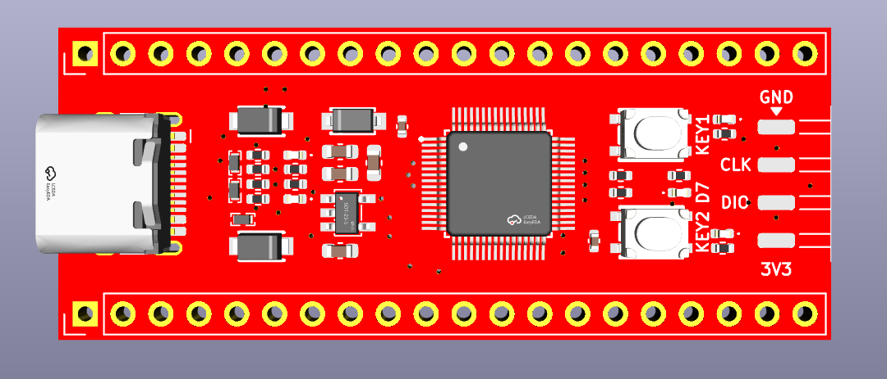

# CH643-Pico

## Introduction
The ch643-pico is a development board based on the WCH CH643Q 32-bit RISC-V MCU. It provides a compact and breadboard-friendly platform for USB Type-C and Power Delivery applications.

## Hardware Resources
*   **MCU**: WCH CH643Q featuring the QingKe-V4C RISC-V core.
*   **Interface**: USB Type-C port for power delivery and data communication.
*   **Power**: Dual power input support with 3.3V regulated output.
*   **Control**: Two user buttons and status LEDs for power and communication monitoring.
*   **Debug**: Dedicated pin headers for UART and SWD interfaces.

## Pin Definitions
| Pin | Label  | Function                   |
| :-- | :----- | :------------------------- |
| 1   | 3.3V   | 3.3V Power Output          |
| 2   | 3.3V   | 3.3V Power Output          |
| 3   | GND    | GND                        |
| 4   | PA23   | TIM2_CH3N                  |
| 5   | PA1    | TIM2_CH2/ADC_IN1           |
| 6   | PA2    | USART2_TX/TIM2_CH3/ADC_IN2 |
| 7   | PA3    | USART2_RX/TIM2_CH4/ADC_IN3 |
| 8   | GND    | GND                        |
| 9   | PA5    | SPI0_SCK/ADC_IN5           |
| 10  | PA6    | SPI0_MISO/TIM3_CH1/ADC_IN6 |
| 11  | PA7    | SPI0_MOSI/TIM3_CH2/ADC_IN7 |
| 12  | PB0    | USART4_TX/ADC_IN8          |
| 13  | PB1    | USART4_RX/ADC_IN9          |
| 14  | PB2    | TIM1_CH2N                  |
| 15  | PB3    | TIM1_CH3N                  |
| 16  | PB4    | GPIO                       |
| 17  | PB6    | TIM1_CH1N/USART3_CTS       |
| 18  | PB7    | TIM1_CH2N/USART3_RTS       |
| 19  | PB8    | TIM1_CH3N                  |
| 20  | PB9    | TIM1_CH1/MCO               |
| 21  | EXT_5V | 5V Power Input             |
| 22  | EXT_5V | 5V Power Input             |
| 23  | GND    | GND                        |
| 24  | 3.3V   | 3.3V Power Output          |
| 25  | EXT_5V | 5V Power Input             |
| 26  | PA21   | TIM2_CH1N                  |
| 27  | PA20   | TIM2_BK                    |
| 28  | GND    | GND                        |
| 29  | PA19   | TIM2_ETR                   |
| 30  | PA15   | GPIO                       |
| 31  | 3.3V   | 3.3V Power Output          |
| 32  | PA11   | I2C_SDA                    |
| 33  | GND    | GND                        |
| 34  | PA10   | I2C_SCL                    |
| 35  | PA8    | USART4_RTS                 |
| 36  | PB15   | USART4_CTS                 |
| 37  | PB23   | GPIO                       |
| 38  | GND    | GND                        |
| 39  | PB21   | GPIO                       |
| 40  | PB14   | GPIO                       |

## Onboard Peripherals
| Component   | Pin  | Logic       |
| :---------- | :--- | :---------- |
| KEY1 | PB12 | Active Low  |
| KEY2 | PB16 | Active Low  |
| LED | PB17 | Active Low |

## Functional Features
*   **Power Path**: Integrated Schottky diodes protect the circuit when using both USB and external power sources.
*   **ESD Protection**: USB data and configuration channel lines are equipped with protection arrays to ensure hardware durability.
*   **Logic Level**: All I/O signals are 3.3V compatible.
